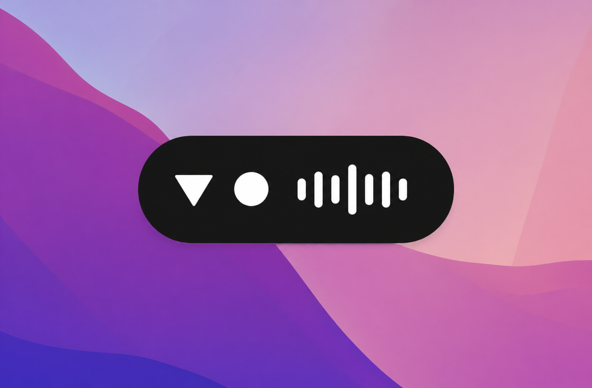

# CyphrWhispr

> Local, private, fast speech-to-text for any text field on your Mac.

CyphrWhispr is a native macOS menu-bar app that adds Wispr-Flow-style dictation to **every** text field on your system. Press a global hotkey, a sleek black pill appears at the bottom of the screen, you speak, you release the key — and the transcription pastes at your cursor. No cloud round-trip, no account, no subscription. Whisper runs locally on Apple Silicon via [WhisperKit](https://github.com/argmaxinc/WhisperKit).

The pill is the signature visual moment: a solid-black capsule with an animated comet of light orbiting its rim, a live waveform that reacts to what you're actually saying, and a comet color you pick yourself.



---

## Why

Existing dictation tools are some combination of cloud-based, paid, account-required, or visually overdone. CyphrWhispr is the privacy-first, aesthetic-first counterpart — a delightful utility that lives quietly in the menu bar like Tailscale or Shottr.

- **Local by default.** Audio never leaves your machine. No telemetry, no analytics, no "anonymous usage statistics."
- **Free and open source.** MIT licensed. Audit it, fork it, ship your own variant.
- **Built for the daily driver.** Sub-second paste-at-cursor. Push-to-talk OR toggle. Works in TextEdit, Slack, Notion, Safari, VS Code, Terminal, and anywhere else you'd type.

---

## Status

This is an early, working prototype that the original author runs daily on their own Mac. Phases 1–3 are complete (menu bar + hotkey + audio + pill + transcription + paste + model picker). Phase 4's encrypted, BIP-39-keyed transcription history is now implemented — an opt-in, on-device AES-256 vault with full-text search; onboarding polish is the last remaining v1 item. The app is currently **run-from-Xcode only** — no signed/notarized release builds yet. See [Roadmap](#roadmap).

If you want to use it today: clone, run from Xcode, you're done in five minutes.

---

## Features

- **Global hotkey** — default `⌥Space`, fully rebindable in Settings (powered by [KeyboardShortcuts](https://github.com/sindresorhus/KeyboardShortcuts) so chord conflicts surface cleanly)
- **Live waveform** that actually reacts to your voice — three independent sine jitters mixed by a center-weighted envelope so loud speech makes the middle bars punch tall and quiet rooms stay calm
- **Animated comet rim** — a soft conic-gradient sweep that orbits the pill capsule at a fixed cadence, with the bright core being your chosen accent color
- **User-controlled accent** — pick from six curated presets (Violet, Magenta, Crimson, Amber, Mint, Cobalt) or use the system color picker. Repaints every accent in the app live: tab pill, model radio dial, rim halo, badge tints
- **Local Whisper** via WhisperKit — Core ML / MLX accelerated on Apple Silicon
- **Hardware-aware model recommendation** — first launch profiles your chip + RAM and picks an appropriate Whisper tier
- **Custom model import** — drop any converted Core ML Whisper bundle into `~/Library/Application Support/CyphrWhispr/models/` (or pick via the Import button)
- **Clipboard-preserving paste** — snapshots all pasteboard items + types and restores them after pasting; transcription content is marked `TransientType`/`ConcealedType` so clipboard managers (Raycast, Alfred, Paste) don't archive it
- **Encrypted history (opt-in)** — turn it on and every dictation is appended to an AES-256 [SQLCipher](https://www.zetetic.net/sqlcipher/) vault on your Mac, unlocked by a 12-word BIP-39 recovery phrase. Browse it grouped by day, search it instantly with SQLite FTS5. Off by default; the phrase lives in your login Keychain so the vault opens automatically and never round-trips to the cloud
- **Menu-bar only** — no Dock icon, no app switcher entry, `LSUIElement = true`
- **Resizable Settings window** with persistent size and position

---

## How it works

```
[Hotkey down] → AVAudioEngine input tap (16kHz mono Float32)
              → Lock-free ring buffer
              → WhisperKit streaming transcription
              → AsyncStream of partial transcripts → pill UI

[Hotkey up]   → Flush remaining audio
              → Await finalized transcript
              → Snapshot pasteboard (all types)
              → Set pasteboard to transcript + Transient/Concealed UTIs
              → Synthesize ⌘V via CGEvent
              → Restore pasteboard snapshot
              → Pill fades out
```

The state machine (`idle → armed → listening → processing → idle`) lives in `AppCoordinator.swift`. The trickiest UX-critical code is in `ClipboardPasteInjector.swift` (timing!) and `PasteboardSnapshot.swift` (multi-type clipboard preservation).

Architecture overview:

```
CyphrWhispr/
├── App/                    @main + state-machine coordinator
├── MenuBar/                NSStatusItem with the down-triangle + circle logo
├── PillWindow/             Floating NSPanel + SwiftUI pill view + waveform
├── Hotkey/                 KeyboardShortcuts wrapper
├── Audio/                  AVAudioEngine capture + ring buffer
├── Transcription/          WhisperKit backend, model catalog, sanitizer
├── TextInsertion/          Clipboard-paste injector + multi-type snapshot
├── Hardware/               sysctl-based chip/RAM profiler + recommender
├── History/                Encrypted SQLCipher vault, BIP-39 keys, FTS5 search
├── Settings/               SwiftUI Settings tabs (General / Shortcut / Models / Polish / History / Customization / About)
└── Resources/              Info.plist, entitlements, asset catalog
```

---

## Build & run

### Requirements

- macOS 14.0 Sonoma or later
- Xcode 15+
- [xcodegen](https://github.com/yonaskolb/XcodeGen) — `brew install xcodegen`
- A code-signing identity (see below; ad-hoc works fine for personal use)

### One-time setup

The Xcode project is generated from `project.yml` so it stays out of source control.

```sh
git clone https://github.com/KenobiNakamoto/CyphrWhispr.git
cd CyphrWhispr
xcodegen generate
open CyphrWhispr.xcodeproj
```

### Code signing for local development

The shipped `project.yml` references a manually-managed self-signed certificate named `CyphrWhispr Dev`. macOS TCC (Microphone, Accessibility) tracks apps by signature, not bundle ID — so a stable signature means you grant permissions **once** and they stick across rebuilds, instead of being prompted on every code change.

You have two options:

**(a) Create the same self-signed cert** (recommended if you'll iterate)

1. Open Keychain Access → Certificate Assistant → "Create a Certificate…"
2. Name: `CyphrWhispr Dev`
3. Identity Type: Self Signed Root
4. Certificate Type: Code Signing
5. Click Create.

Then build normally from Xcode.

**(b) Switch to ad-hoc signing** (zero setup, but you'll re-grant Mic + Accessibility every time you rebuild and the signature changes)

In `project.yml`, change:

```yaml
CODE_SIGN_STYLE: Manual
CODE_SIGN_IDENTITY: "CyphrWhispr Dev"
```

to:

```yaml
CODE_SIGN_STYLE: Manual
CODE_SIGN_IDENTITY: "-"
```

Then `xcodegen generate` and rebuild.

### Permissions

On first run the app asks for:

- **Microphone** — to capture audio while you hold the hotkey. Required.
- **Accessibility** — to synthesize the ⌘V keystroke into the focused app. Required for paste-at-cursor.

Both prompts are launched by the OS at the moment they're needed. Deny → the app degrades gracefully (you can re-enable from System Settings → Privacy & Security).

---

## Choosing a Whisper model

First launch profiles your chip + RAM and recommends a Whisper tier (the recommendation banner in **Settings → Models** explains why). You can switch at any time — the active model live-reloads in the background, no restart.

| Chip | RAM | Recommended | Approx size | Speed |
|---|---|---|---|---|
| Intel | any | `tiny.en` | 75 MB | ~0.5× realtime |
| M1 / M2 base | 8 GB | `small.en` | 466 MB | ~1.5× realtime |
| M1 / M2 / M3 | 16 GB | `medium.en` | 1.5 GB | ~2× realtime |
| M3 / M4 Pro / Max | 18 GB+ | `large-v3-turbo` | 1.6 GB | ~1.5× realtime, near-large quality |
| M-Ultra | 64 GB+ | `large-v3` | 3 GB | ~1× realtime |

Defaults are `.en` English-only variants. Switch to multilingual `large-v3` in Settings if you dictate in other languages.

### Custom models

Drop any converted Core ML Whisper bundle into `~/Library/Application Support/CyphrWhispr/models/<your-model-name>/` and it shows up in the Models tab marked **CUSTOM**. Or click **Import custom…** and pick the folder.

You can convert a HuggingFace Whisper model to Core ML using [WhisperKit's CLI](https://github.com/argmaxinc/WhisperKit#tools).

---

## Customizing the look

Open **Settings → About → Accent color** and pick a swatch (or use the system picker for a custom hex). The choice repaints everything that draws an accent — Settings tabs, model radio dial, the pill's comet halo, badge tints — live, no restart. Persisted to UserDefaults.

If you want to change the *fixed* parts of the design (background gradient, card surfaces, text shades), edit `CyphrWhispr/Settings/SettingsDesign.swift` — every Settings view reads from there.

---

## Tech stack

- **Swift 5.9+, SwiftUI + AppKit**
- **macOS 14 Sonoma minimum** (modern `Settings` scene + `MenuBarExtra` + WhisperKit Core ML targets)
- **[WhisperKit](https://github.com/argmaxinc/WhisperKit)** — Swift-native, Core ML + MLX-accelerated, async/await streaming
- **[KeyboardShortcuts](https://github.com/sindresorhus/KeyboardShortcuts)** by sindresorhus — global hotkey capture & rebinding
- **AVAudioEngine** input tap → 16kHz mono Float32 → lock-free ring buffer → Whisper
- **CGEvent** for synthesized ⌘V (clipboard-paste injection)
- **xcodegen** so the `.xcodeproj` is generated from `project.yml` and stays out of git

---

## Roadmap

The original implementation plan is broken into four phases. The first three are done; Phase 4 is largely complete.

- [x] **Phase 1** — Skeleton, menu bar, hotkey, audio capture, pill window
- [x] **Phase 2** — Streaming transcription, live partials in the pill, clipboard-preserving paste
- [x] **Phase 3** — Hardware detect, model recommendation, downloader, custom model import
- [ ] **Phase 4** — Encrypted history with BIP-39-derived keys. **Done:** opt-in AES-256 SQLCipher vault, day-grouped history browser, FTS5 search, auto-unlock via the login Keychain. **Remaining:** onboarding polish.

Deferred to v1.1 / "ready to share":

- Developer ID signing + notarization + DMG / Sparkle auto-update
- Animated menu-bar icon states (idle / recording / transcribing)
- iCloud Keychain sync of the vault recovery phrase (default off)
- "Bring your own phrase" import accepting 12/24 BIP-39 words

---

## Contributing

Issues and PRs welcome. The codebase is small (~30 Swift files), heavily commented in the style of a colleague explaining a tricky design decision rather than a doc comment generator. Read a few files in `CyphrWhispr/PillWindow/` or `CyphrWhispr/TextInsertion/` and you'll have a feel for the house style fast.

Before opening a PR:

- Run `xcodegen generate` after any change to `project.yml`
- Build clean (no new warnings)
- Match the existing comment voice — explain *why*, not *what*
- For UI changes, attach a before/after screenshot

For larger work (new tabs, new models, crypto changes), open an issue first so we can sanity-check the design.

---

## License

[MIT](LICENSE) — do whatever you want, just keep the copyright + license notice. No warranty, no liability. See `LICENSE` for the full text.

---

## Credits

- [WhisperKit](https://github.com/argmaxinc/WhisperKit) by Argmax — the Swift-native Whisper Core ML pipeline that does the heavy lifting
- [KeyboardShortcuts](https://github.com/sindresorhus/KeyboardShortcuts) by Sindre Sorhus — global hotkey capture
- [OpenAI Whisper](https://github.com/openai/whisper) — the underlying speech recognition model
- The Wispr Flow + MacWhisper teams for proving local STT can feel magical

If you ship something built on top of CyphrWhispr, I'd love to hear about it.
